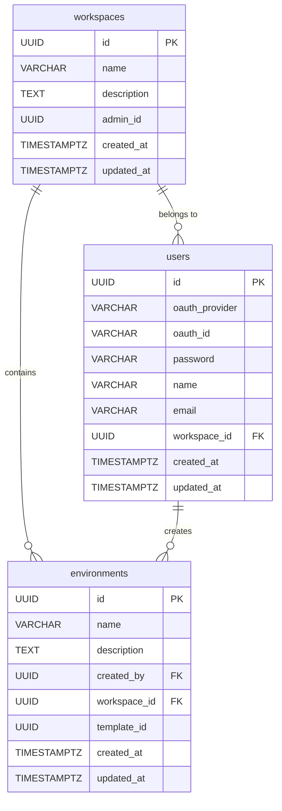

# dev-share

## Database Schema

```mermaid
erDiagram
    workspaces {
        UUID id PK
        VARCHAR name
        TEXT description
        UUID admin_id
        TIMESTAMPTZ created_at
        TIMESTAMPTZ updated_at
    }
    users {
        UUID id PK
        VARCHAR oauth_provider
        VARCHAR oauth_id
        VARCHAR password
        VARCHAR name
        VARCHAR email
        UUID workspace_id FK
        TIMESTAMPTZ created_at
        TIMESTAMPTZ updated_at
    }
    environments {
        UUID id PK
        VARCHAR name
        TEXT description
        UUID created_by FK
        UUID workspace_id FK
        UUID template_id
        TIMESTAMPTZ created_at
        TIMESTAMPTZ updated_at
    }

    workspaces ||--o{ users : "belongs to"
    workspaces ||--o{ environments : "contains"
    users ||--o{ environments : "creates"
```
